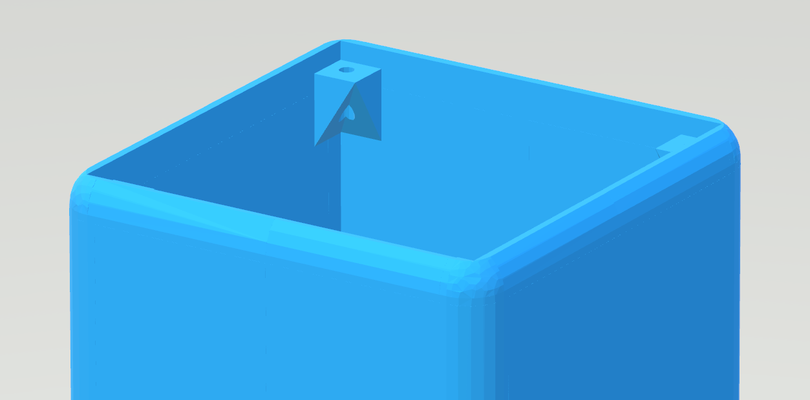

# NANOLEAF NANO 3D FILES
### The design files of Nanoleaf Nano in .glb and .obj format

+ Information
+ Image
+ Contact

### Information
This repository includes the design files for the Nanoleaf Nano in both .glb and .obj used for 3D printing. Nano is a small-sized sensor-box which uses artificial intelligence and data from a weather API to warn about drastic changes in weather or surroundings due to phenomenas such as wildfires. Nano uploads processed data directly to a web app where users can access current wildfire, flood or hurricane risk warnings in their area. 

### Image

The image displays the side/above view of the Nano.

### Contact
Please contact Nanoleaf Technologies over [Mail](mailto:nanoleaftec@gmail.com)
